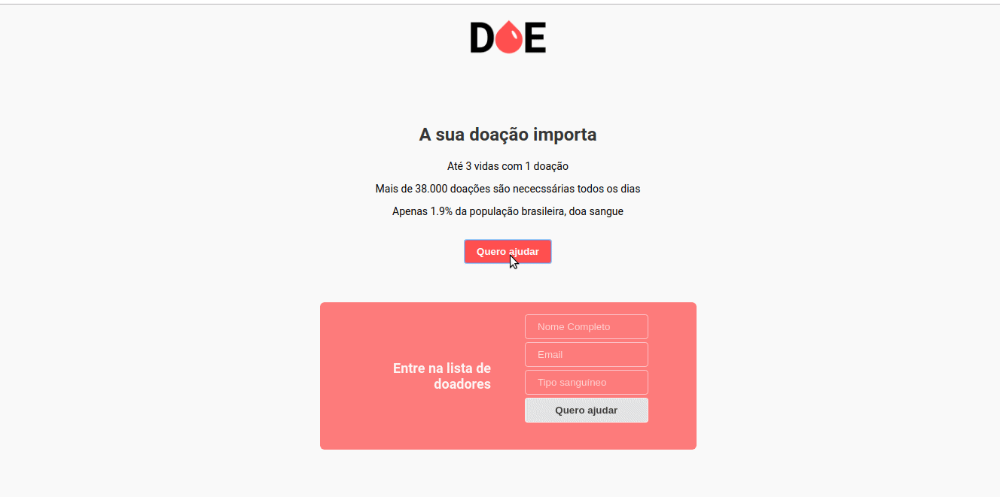

## Sobre o projeto



Este software visa controlar o cadastramento de doadores de sangue para contato posterior

### Construído com:
As estruturas que o projeto contempla são:
* [Node.JS](https://nodejs.org/en/)
* [Nodemon](https://nodemon.io/)
* [Express](http://expressjs.com/)
* [PostgreSQL](https://www.postgresql.org/)

<!-- GETTING STARTED -->
## Começando

Para obter uma cópia local em execução, siga estas etapas simples de exemplo.

### Pré-requisitos

Este é um exemplo de como listar as coisas necessárias para usar o software e como instalá-las.
* npm 
```sh
npm install npm@latest -g
```

### Instalação

1. Clone o repositório
```sh
git clone https://github.com/DaywisonFerreira/doeSangue.git
```
3. Instale as dependências
```sh
npm install
```


<!-- ROADMAP -->
## Roadmap
O software é um produto mínimo viável (MVP), portanto será necessário aprimorar os recursos antes de sua implementação.

<!-- CONTACT -->
## Contato

Daywison Leal - [LinkedIn](https://www.linkedin.com/in/daywison-ferreira-leal-ba6878127/) - daywison.leal@gmail.com

Link do Projeto: [https://github.com/DaywisonFerreira/doeSangue](https://github.com/DaywisonFerreira/doeSangue)
